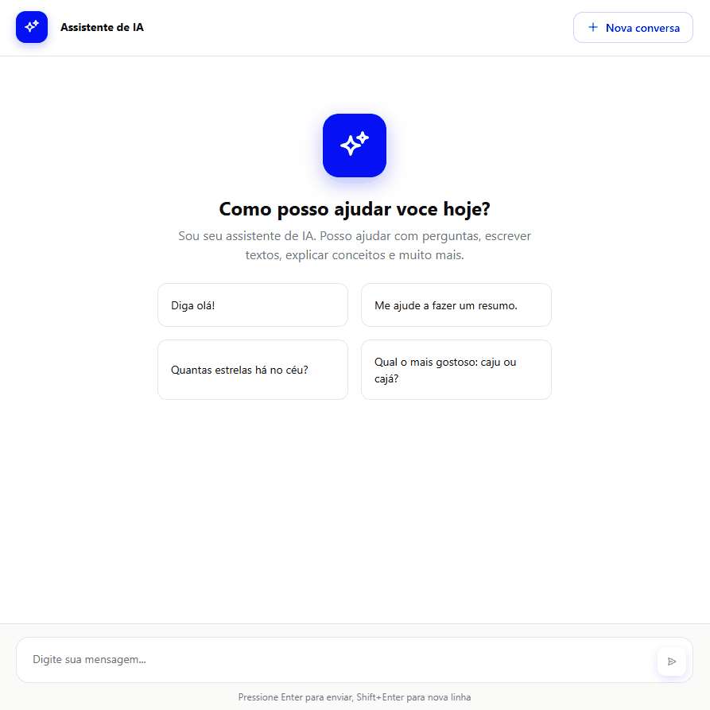

> **Shinydeep** is a packaged Shiny application that provides an AI-powered chat interface using the DeepSeek API. Built as a proper R package, it offers seamless deployment, dependency management, and reusability across projects. The template was generated by [v0.app](https://v0.app/). The data comes from Global Biodiversity Information Facility, but was only used observations from Poland. A live example can be accessed [here](http://142.93.67.223/shiny/shinydeep/). 


### Why Package a Shiny App?

- ✅ **Version control** - Track changes systematically
- ✅ **Dependency management** - Automatic package installation
- ✅ **Namespace isolation** - No function conflicts
- ✅ **Easy distribution** - Share via GitHub, CRAN, or internal repos
- ✅ **Reproducibility** - Consistent behavior across environments

## 🔧 Installation

### Prerequisites

- **R version 4.1.0 or higher**
- **RStudio** (recommended for development)
- **Git** (for cloning the repository)
- **DeepSeek API Key** (for AI features)

### Install from GitHub

```r
# Install devtools if not already installed
if (!requireNamespace("devtools", quietly = TRUE)) {
  install.packages("devtools")
}

# Install myShinyApp directly from GitHub
devtools::install_github("dimitribessa/shinydeep")
```